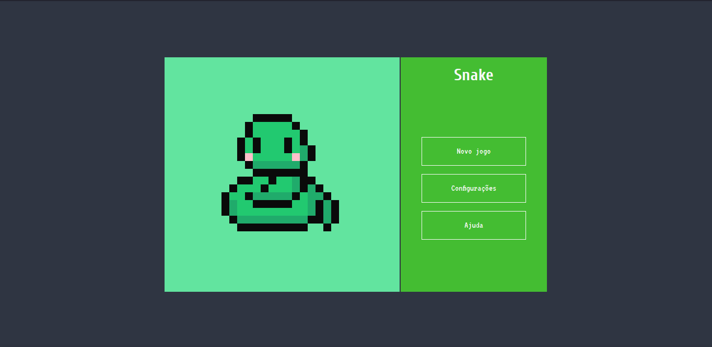

#  Jogo da cobrinha

Jogo da cobrinha desenvolvido com javascript, para testar meu conhecimento em javascript.

### Ainda falta

- [ ] Adicionar musica e efeitos
- [ ] Adicionar tela de scores no painel;
- [ ] Adicionar Configurações (velocidade e teleport)
- [ ] Adicionar Ajuda
- [ ] Adicionar função para aumentar a velocidade da cobra no decorrer do jogo
- [ ] Adicionar suporte para touch
- [ ] Criar a tela de end para quando o jogador morrer

Teste o jogo no seu navegador <a href="https://lucasfernandodev.github.io/snake/" title="snake">clicando aqui</a>!